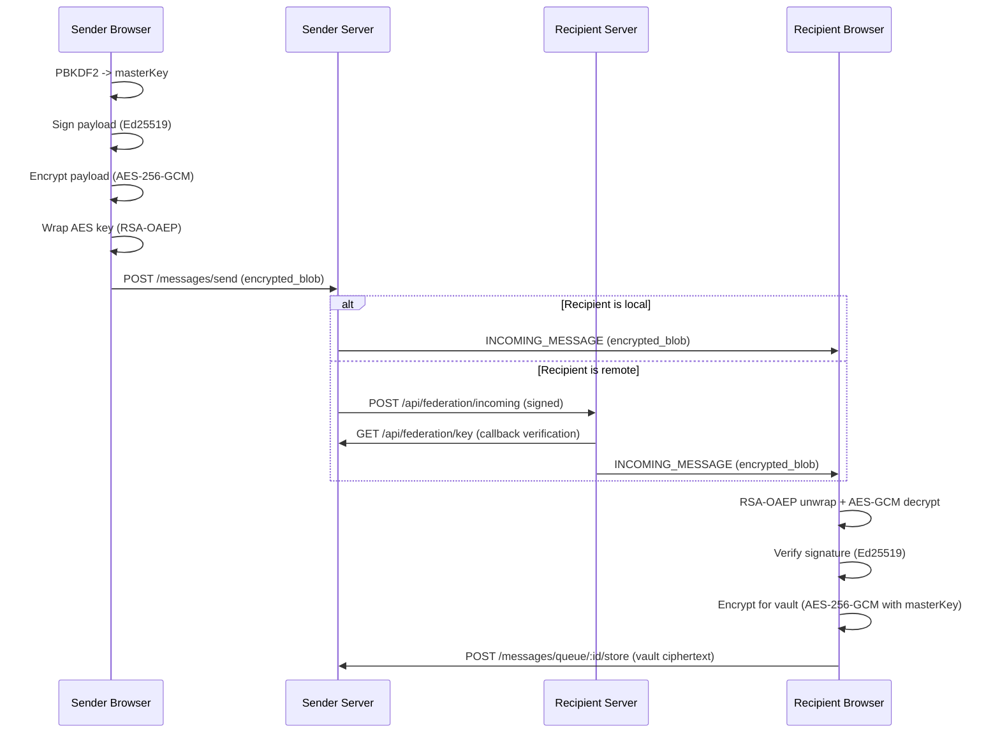

# Ratchet Chat Security and Cryptography

This document describes how Ratchet Chat protects message confidentiality,
integrity, and server-to-server trust. It focuses on *what encryption is used,
where it is applied, and what data is stored*.

## Scope and assumptions

- The server acts as a blind relay + storage system for encrypted blobs. It does
  not see plaintext messages or private keys.
- Clients are responsible for encrypting, decrypting, and signing messages.
- Transport security (HTTPS/TLS) is expected in production deployments.
- Servers are deployed with a strict CORS allowlist so only the trusted client
  origin can use browser APIs.

## Cryptographic primitives (summary)

| Area | Algorithm | Purpose | Location |
| --- | --- | --- | --- |
| SRP-6a | SHA-256 + modular exponentiation | Zero-knowledge password auth | Client/Server (`/auth/srp/*`) |
| Master key KDF | PBKDF2-HMAC-SHA256 | Derive `masterKey` for local encryption | Client |
| Message signatures | Ed25519 (tweetnacl) | Sender authenticity | Client |
| Transit encryption | AES-256-GCM | Encrypt message payload during transit | Client |
| Transit key wrap | RSA-OAEP 2048 + SHA-256 | Wrap AES transit key to recipient | Client |
| Local storage encryption | AES-256-GCM | Encrypt local message vault + private keys | Client |
| Federation signatures | Ed25519 (Node crypto) | Server-to-server request auth | Server |
| JWT | HMAC-SHA256 (jsonwebtoken) | API authentication | Server/Client |

## Key material and storage

### User keys (client-side generated)

- **Identity key pair (Ed25519)**: generated in the browser.
  - Public key is sent to the server and exposed via directory endpoints.
  - Private key is encrypted with the `masterKey` (AES-GCM) and stored:
    - On the server in `User.encrypted_identity_key` + `encrypted_identity_iv`.
    - In client IndexedDB for persistence.
- **Transport key pair (RSA-OAEP 2048)**: generated in the browser.
  - Public key is sent to the server and exposed via directory endpoints.
  - Private key is encrypted with the `masterKey` (AES-GCM) and stored the same
    way as the identity key.

### Password-derived keys

- **SRP verifier (`srp_verifier`)**: computed client-side from the password and
  `srp_salt` using SRP-6a. The server stores the verifier and never receives the
  plaintext password.
- The server enforces minimum and maximum iteration counts for `kdf_iterations`
  to prevent weak client-supplied parameters.
- **Master key (`masterKey`)**: derived with PBKDF2 using `kdf_salt` and
  `kdf_iterations`. Used to encrypt private keys and local message storage
  (MessageVault).
- The master key is kept in memory and cached in `sessionStorage` for the active
  session. It is not sent to the server.

### SRP login flow (high level)

- Client generates ephemeral `A` and sends it to `/auth/srp/start`.
- Server returns `salt` and ephemeral `B`.
- Client computes proof `M1` from the password without revealing it and sends
  it to `/auth/srp/verify`.
- Server verifies `M1`, returns JWT + `M2`.
- Client verifies `M2` to confirm the server knows the verifier.

### Federation keys (server-side)

- Each server generates an Ed25519 key pair on first boot.
- Keys are stored in an env-like `.cert` file (`SERVER_CERT_PATH`), with:
  - `SERVER_PRIVATE_KEY` (PKCS8 DER, Base64)
  - `SERVER_PUBLIC_KEY` (SPKI DER, Base64)
- The `.cert` file is written with `0600` permissions and corrected on load.
- The public key is exposed at `GET /api/federation/key` for callback
  verification.

## Message confidentiality and integrity

### 1) Signing (authenticity)

When a user sends a message, the client signs a payload with the Ed25519
identity private key:

```
["ratchet-chat:message:v1", sender_handle, content, message_id]
```

The signature and sender identity public key are embedded in the transit
payload. Recipients verify the signature before storing or displaying messages.

### 2) Transit encryption (end-to-end)

The client encrypts the message payload before sending it to any server:

- Generate a random 32-byte AES key.
- Encrypt the payload with **AES-256-GCM** (random IV).
- Wrap the AES key using **RSA-OAEP** with the recipient's public transport key.
- Send the envelope as `encrypted_blob` to `/messages/send`.

The server stores or forwards only the opaque `encrypted_blob`.

### 3) Local re-encryption for storage

After decrypting the transit blob, the recipient client:

- Verifies the sender signature.
- Encrypts the plaintext message with the `masterKey` using **AES-256-GCM**.
- Uploads to `/messages/queue/:id/store` or `/messages/vault` for persistence.

The server’s MessageVault stores only ciphertext and IVs.

## Federation security (server-to-server)

Federation uses signed requests plus callback verification:

- Outgoing federation requests are signed with the sender server’s Ed25519
  private key.
- Headers:
  - `X-Ratchet-Host`: sender host
  - `X-Ratchet-Sig`: Base64 Ed25519 signature of `JSON.stringify(body)`
- The recipient server fetches the sender’s public key via:
  `GET https://<senderHost>/api/federation/key` (forced HTTPS in production).
- The recipient server also checks that `sender_handle` host matches
  `X-Ratchet-Host` to prevent spoofing.
- The server rejects federation callbacks to private/reserved IPs in production
  and can be constrained to an allowlist via `FEDERATION_ALLOWED_HOSTS`.
- Federation requests are rate-limited and protected against replay using a
  short-lived in-memory replay cache.
- Federation public keys are cached with a TTL to allow key rotation.

### Discovery and trust model

- Servers publish a signed discovery document at
  `/.well-known/ratchet-chat/federation.json` containing endpoints and public keys.
- The document is signed with the current federation key (`signature` +
  `signature_kid`).
- Trust defaults to TOFU (trust-on-first-use): the first key is pinned per host,
  and subsequent discovery docs must verify against the pinned key.
- The allowlist (`FEDERATION_ALLOWED_HOSTS`) can be used to lock federation to
  known hosts.
- DNS pinning is optional and not required for the default TOFU flow.

## Transport security

- The client uses WebCrypto; browsers require a secure context (HTTPS) or
  `localhost` during development.
- In production, the federation callback uses HTTPS even if the host is not
  localhost.
- The server can optionally terminate TLS directly using `FEDERATION_TLS_*`
  environment variables, but is typically deployed behind a reverse proxy.
- The server applies security headers (CSP, HSTS, nosniff, etc.) and uses a
  strict CORS allowlist for browser traffic.

## Logging and redaction

- Server logging redacts sensitive fields (passwords, private keys, tokens).
- Encrypted blobs and metadata may appear in logs; plaintext should not.

## Abuse protection

- Login attempts are rate-limited with exponential backoff on failures to slow
  brute-force attempts.
- Federation callbacks and auth endpoints are rate-limited per source.

## Data at rest

- Database stores only encrypted message blobs and encrypted private keys.
- SRP verifiers are stored, not plaintext passwords.
- Federation keys are stored in `.cert`; protect the volume and file permissions.

## Security flow diagram (end-to-end)


